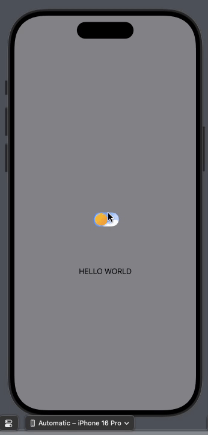

# Day-and-Night-Toggle-SwiftUI

A custom toggle switch for SwiftUI that provides a beautiful day-night animation without using any asset images. This component is highly customizable, lightweight, and seamlessly integrates with any SwiftUI project.

## Features

- **No Asset Images:** Fully drawn using SwiftUI's vector graphics capabilities.
- **Smooth Animations:** Elegant transition between day and night states.
- **Customizable:** Easily adjust colors, shapes, and animations to suit your needs.
- **Lightweight:** Minimal code footprint for easy integration.
- **Support for Accessibility:** Compatible with dark mode and accessibility settings.

## Preview



## Installation

To use `day-and-night-toggle-swiftUI` in your SwiftUI project, you can simply copy the source files or add the package via Swift Package Manager.

### Using Swift Package Manager:

1. Open your project in Xcode.
2. Go to `File` -> `Add Packages...`.
3. Search for the repository URL: `https://github.com/yourusername/day-and-night-toggle-swiftUI`
4. Select the version and click `Add Package`.

### Manual Installation:

- Download the source code from the repository.
- Drag and drop the `DayNightToggle` folder into your Xcode project.

## Usage

### Basic Usage

To use the `DayNightToggle` in your SwiftUI view, you can simply add it to your view hierarchy:

```swift
@available(iOS 13.0, *)
struct PreviewWrapper: View {
    /// State variable to manage the background color of the view.
    @State private var backgroundColor: Color = .gray

    var body: some View {
        ZStack {
            // Background color that fills the entire screen, ignoring safe areas.
            backgroundColor
                .edgesIgnoringSafeArea(.all)
            
            // `ToggleView` with a completion handler that changes the background color and system appearance.
            ToggleView(
                completionHandler: { isOn in
                    // Update the background color based on the toggle state.
                    backgroundColor = isOn ? .gray : .black
                    
                    // Change the app's interface style to dark or light mode based on the toggle state.
                    if !isOn {
                        UIApplication.shared.windows.first?.overrideUserInterfaceStyle = .dark
                    } else {
                        UIApplication.shared.windows.first?.overrideUserInterfaceStyle = .light
                    }
                }
            )
            
            // Additional text displayed below the toggle for demonstration purposes.
            Text("HELLO WORLD")
                .offset(y: 115) // Position the text vertically below the toggle.
        }
    }
}
```

## Requirements

- iOS 14.0+
- SwiftUI

## Contributing

Contributions are welcome! If you have ideas or find issues, feel free to create an issue or submit a pull request.

## License

This project is licensed under the MIT License. See the [LICENSE](LICENSE) file for more information.

